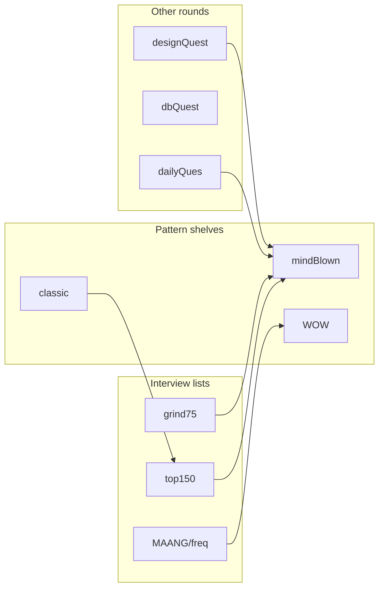

<p align="center">
  
  
  
</p>

<h1 align="center">leetcode-solutions-n8n</h1>

<p align="center">
  <b>A mapped interview gym — not a dump of files.</b><br/>
  Java solutions + AI study guides, filed the way you actually prepare:<br/>
  Grind 75 · Top Interview 150 · MAANG frequency · daily · design · SQL · “mind blown”.
</p>

<p align="center">
  
  
  
  
  
  
</p>

---

## Why this repo exists

Most LeetCode folders are a pile of `.java` files named after the last contest. This one is a **curriculum graph**.

The same problem can live in more than one track on purpose. `lru-cache` is not “done” when it compiles — it is a **design** question, a **linked-list** question, a **Grind75 week 9** question, and a **Top 150** question. Here those identities sit next to each other, each with the same study-guide skeleton: intuition, algorithm, pitfalls, interview talk-track, similar problems.

That is the point of the `n8n` in the name: a repeatable pipeline that turns a solution into a **revision artifact**, then files it under the lists interviewers actually use.

| | |
|---|---|
| **605** problem folders | each with `README.md` study guide |
| **602** `solution.java` files | plus **4** `solution.js` |
| **333** unique LeetCode slugs | **172** appear in 2+ tracks |
| **Java** first | SQL lives in `dbQuest` (queries inside the Java-labeled writeup) |

---

## Start here (pick an entry point)

| If you are… | Open this |
|---|---|
| Starting a 12-week interview sprint | [`grind75/12w`](grind75/12w) |
| Covering the official interview list by topic | [`top150`](top150) |
| Hunting company-hard problems | [`MAANG/freq`](MAANG/freq) |
| Collecting “this trick is famous” solutions | [`mindBlown`](mindBlown) · [`WOW`](WOW) · [`classic`](classic) |
| Keeping a daily streak | [`dailyQues`](dailyQues) |
| Practicing LLD / caches / streams | [`designQuest`](designQuest) |
| Warming up SQL | [`dbQuest`](dbQuest) |
| Running a mock set | [`mock/layrs`](mock/layrs) |
| Sorting by difficulty only | [`problems`](problems) |

```text
You ──► grind75 (reps)
     ──► top150 (topic coverage)
     ──► MAANG/freq (pressure)
     ──► mindBlown / WOW (the aha)
     ──► designQuest + dbQuest (the other round)
```

---

## Anatomy of one problem

Every writeup is meant to be **re-read the night before**, not reverse-engineered from code.

```text
slug/
  README.md          # study guide (source of truth)
  solution.java      # what you submit
  solution.js        # rare second language
```

A typical `README.md` carries:

1. **Header** — difficulty, language, tags, claimed time/space  
2. **Solution** — the code, inlined  
3. **Quick revision** — one-screen restatement  
4. **Intuition** — the aha, in words  
5. **Algorithm** — numbered steps  
6. **Concept to remember** — the reusable pattern  
7. **Common mistakes** — what fails in a 45-minute round  
8. **Complexity** — and when the memo table is lying to you  
9. **Commented code** — line-level narration  
10. **Interview tips** — what to say out loud  
11. **Revision checklist** — boxes to tick  
12. **Similar problems** — the next node in the graph  

Example (Kadane, the classic): [`classic/kadane/maximum-subarray`](classic/kadane/maximum-subarray)

Example (DP + memo, MAANG-flavored): [`MAANG/freq/2/interleaving-string`](MAANG/freq/2/interleaving-string)

Example (SQL join, not a Java algorithm): [`dbQuest/sql-1/combine-two-tables`](dbQuest/sql-1/combine-two-tables)

---

## Map of the gym

```text
leetcode-solutions-n8n
├── grind75/12w/01..12     67  — timed interview spine
├── top150/                147 — topic shelves (arr-str … tries)
├── MAANG/freq/2..5         41 — frequency buckets (harder as the number rises)
├── mindBlown/             112 — “I want the trick, not the list”
├── WOW/                    74 — same energy; some files, mostly folders
├── dailyQues/03..09        88 — calendar months
├── expidition/01..09       25 — expedition batches (spelling as in-tree)
├── mock/layrs              13 — mock interview pack
├── designQuest/             9 — Cache, streaming, CDOS, DSD, business
├── dbQuest/                10 — sql-1 / fna / gna
├── classic/                 4 — Fenwick, Kadane, Moore voting
├── problems/               14 — easy / medium / hard overflow
└── topInterview/            1 — extra interview slug
```

### How tracks connect

The same slug is **copied into every list it belongs to**. That is the index.



**Highest-degree nodes** (same problem, many rooms):

| Appearances | Slug | Canonical read |
|---:|---|---|
| 6 | `lru-cache` | [`mindBlown/lru-cache`](mindBlown/lru-cache) |
| 5 | `basic-calculator` | [`mindBlown/basic-calculator`](mindBlown/basic-calculator) |
| 5 | `binary-tree-maximum-path-sum` | [`mindBlown/binary-tree-maximum-path-sum`](mindBlown/binary-tree-maximum-path-sum) |
| 5 | `design-add-and-search-words-data-structure` | [`mindBlown/design-add-and-search-words-data-structure`](mindBlown/design-add-and-search-words-data-structure) |
| 5 | `find-median-from-data-stream` | [`mindBlown/find-median-from-data-stream`](mindBlown/find-median-from-data-stream) |
| 5 | `median-of-two-sorted-arrays` | [`mindBlown/median-of-two-sorted-arrays`](mindBlown/median-of-two-sorted-arrays) |
| 5 | `merge-intervals` | [`mindBlown/merge-intervals`](mindBlown/merge-intervals) |
| 5 | `merge-k-sorted-lists` | [`mindBlown/merge-k-sorted-lists`](mindBlown/merge-k-sorted-lists) |
| 5 | `minimum-window-substring` | [`mindBlown/minimum-window-substring`](mindBlown/minimum-window-substring) |
| 5 | `remove-nth-node-from-end-of-list` | [`mindBlown/remove-nth-node-from-end-of-list`](mindBlown/remove-nth-node-from-end-of-list) |
| 5 | `trapping-rain-water` | [`mindBlown/trapping-rain-water`](mindBlown/trapping-rain-water) |

`lru-cache` wiring (the full star):

```text
designQuest/Cache/lru-cache
expidition/01/lru-cache
grind75/12w/09/lru-cache
mindBlown/lru-cache
problems/medium/lru-cache
top150/linked/lru-cache
```

If you only memorize one graph, memorize that: **design + list + grind + topic + “wow”**.

---

## Study paths (multi-year shape, 12-week pace)

This is not a claim that the git history is ancient. It is a **career-shaped syllabus**: the lists people rerun every year they interview.

### Path A — 12 weeks (Grind 75)

Work [`grind75/12w`](grind75/12w) in order. One week is a mock: timed, no notes, then read the study guide.

| Week | Problems |
|---|---|
| [01](grind75/12w/01) | `01-matrix`, `3sum`, `insert-interval`, `k-closest-points-to-origin`, `longest-substring-without-repeating-characters`, `maximum-subarray` |
| [02](grind75/12w/02) | `binary-tree-level-order-traversal`, `clone-graph`, `coin-change`, `course-schedule`, `evaluate-reverse-polish-notation`, `implement-trie-prefix-tree` |
| [03](grind75/12w/03) | `min-stack`, `number-of-islands`, `product-of-array-except-self`, `rotting-oranges`, `search-in-rotated-sorted-array`, `validate-binary-search-tree` |
| [04](grind75/12w/04) | `combination-sum`, `lowest-common-ancestor-of-a-binary-tree`, `minimum-window-substring`, `permutations`, `time-based-key-value-store` |
| [05](grind75/12w/05) | `find-median-from-data-stream`, `serialize-and-deserialize-binary-tree`, `sort-colors` |
| [06](grind75/12w/06) | `binary-tree-right-side-view`, `partition-equal-subset-sum`, `spiral-matrix`, `string-to-integer-atoi`, `subsets`, `word-break` |
| [07](grind75/12w/07) | `basic-calculator`, `longest-palindromic-substring`, `maximum-profit-in-job-scheduling`, `word-ladder` |
| [08](grind75/12w/08) | `construct-binary-tree-from-preorder-and-inorder-traversal`, `container-with-most-water`, `largest-rectangle-in-histogram`, `letter-combinations-of-a-phone-number`, `unique-paths` |
| [09](grind75/12w/09) | `find-all-anagrams-in-a-string`, `lru-cache`, `minimum-height-trees`, `task-scheduler`, `word-search` |
| [10](grind75/12w/10) | `daily-temperatures`, `gas-station`, `group-anagrams`, `house-robber`, `next-permutation`, `valid-sudoku` |
| [11](grind75/12w/11) | `design-add-and-search-words-data-structure`, `find-the-duplicate-number`, `maximum-product-subarray`, `pacific-atlantic-water-flow`, `remove-nth-node-from-end-of-list` |
| [12](grind75/12w/12) | `binary-tree-maximum-path-sum`, `course-schedule-ii`, `decode-string`, `longest-consecutive-sequence`, `maximum-frequency-stack`, `odd-even-linked-list`, `path-sum-ii`, `rotate-array`, `swap-nodes-in-pairs`, `top-k-frequent-words` |

### Path B — topic shelves (Top Interview 150)

Stay inside [`top150`](top150) until a shelf is boring. Then jump to the same slug in [`mindBlown`](mindBlown) for the sharper writeup.

| Shelf | Count | Folder |
|---|---:|---|
| Arrays / strings | 22 | [`top150/arr-str`](top150/arr-str) |
| Trees | 20 | [`top150/trees`](top150/trees) |
| Linked lists | 11 | [`top150/linked`](top150/linked) |
| Hash maps | 9 | [`top150/hashmap`](top150/hashmap) |
| Graphs | 9 | [`top150/graphs`](top150/graphs) |
| Multidimensional DP | 9 | [`top150/mddp`](top150/mddp) |
| Binary search | 7 | [`top150/binary-search`](top150/binary-search) |
| Two pointers | 6 | [`top150/two-pointer`](top150/two-pointer) |
| Backtracking | 6 | [`top150/backtracking`](top150/backtracking) |
| Stack | 6 | [`top150/stack`](top150/stack) |
| DP (1D) | 5 | [`top150/dp`](top150/dp) |
| Math | 5 | [`top150/math`](top150/math) |
| Bits | 5 | [`top150/bits`](top150/bits) |
| Matrix | 5 | [`top150/matrix`](top150/matrix) |
| Heap | 4 | [`top150/heap`](top150/heap) |
| Intervals | 4 | [`top150/intervals`](top150/intervals) |
| Sliding window | 4 | [`top150/sliding`](top150/sliding) |
| Divide & conquer | 4 | [`top150/divide-conquer`](top150/divide-conquer) |
| Tries | 3 | [`top150/tries`](top150/tries) |
| Kadane | 2 | [`top150/kadane`](top150/kadane) |
| Extra | 1 | [`top150/mindBlown`](top150/mindBlown) |

### Path C — MAANG frequency

[`MAANG/freq`](MAANG/freq) is bucketed **2 → 5**. Treat higher buckets as “they will ask a variant of this.”

| Bucket | Count | Highlights |
|---|---:|---|
| [`freq/2`](MAANG/freq/2) | 6 | `interleaving-string`, `making-a-large-island`, `split-array-largest-sum` |
| [`freq/3`](MAANG/freq/3) | 8 | `n-queens`, `wildcard-matching`, `all-oone-data-structure`, `sliding-puzzle` |
| [`freq/4`](MAANG/freq/4) | 16 | `regular-expression-matching`, `sudoku-solver`, `word-ladder-ii`, `sliding-window-median` |
| [`freq/5`](MAANG/freq/5) | 11 | `the-skyline-problem`, `trapping-rain-water`, `serialize-and-deserialize-binary-tree`, `word-search-ii` |

### Path D — other rounds

- Design: [`designQuest/Cache`](designQuest/Cache) (`lru-cache`, `lfu-cache`) → [`designQuest/streaming`](designQuest/streaming) → [`designQuest/dsd`](designQuest/dsd) → [`designQuest/cdos`](designQuest/cdos) → [`designQuest/business`](designQuest/business)
- SQL: [`dbQuest/sql-1`](dbQuest/sql-1) then [`dbQuest/fna`](dbQuest/fna) then [`dbQuest/gna`](dbQuest/gna)
- Mock: [`mock/layrs`](mock/layrs) — 13 problems, sit down for 90 minutes
- Classics as flashcards: Fenwick [`count-of-smaller-numbers-after-self`](classic/fenwickTree/count-of-smaller-numbers-after-self), Kadane [`maximum-subarray`](classic/kadane/maximum-subarray), Moore [`majority-element`](classic/moore-voting/majority-element)

---

## Track indexes

### `classic` — named algorithms

| Pattern | Problem |
|---|---|
| Fenwick / BIT | [`count-of-smaller-numbers-after-self`](classic/fenwickTree/count-of-smaller-numbers-after-self) |
| Kadane | [`maximum-subarray`](classic/kadane/maximum-subarray) |
| Moore voting | [`majority-element`](classic/moore-voting/majority-element), [`count-subarrays-with-majority-element-i`](classic/moore-voting/count-subarrays-with-majority-element-i) |

### `designQuest`

| Area | Problems |
|---|---|
| Cache | [`lru-cache`](designQuest/Cache/lru-cache), [`lfu-cache`](designQuest/Cache/lfu-cache) |
| Streaming | [`data-stream-as-disjoint-intervals`](designQuest/streaming/data-stream-as-disjoint-intervals), [`kth-largest-element-in-a-stream`](designQuest/streaming/kth-largest-element-in-a-stream), [`stream-of-characters`](designQuest/streaming/stream-of-characters) |
| DSD | [`insert-delete-getrandom-o1-duplicates-allowed`](designQuest/dsd/insert-delete-getrandom-o1-duplicates-allowed) |
| CDOS | [`range-frequency-queries`](designQuest/cdos/range-frequency-queries), [`subrectangle-queries`](designQuest/cdos/subrectangle-queries) |
| Business | [`simple-bank-system`](designQuest/business/simple-bank-system) |

### `dbQuest`

| Set | Problems |
|---|---|
| sql-1 | [`combine-two-tables`](dbQuest/sql-1/combine-two-tables), [`customer-placing-the-largest-number-of-orders`](dbQuest/sql-1/customer-placing-the-largest-number-of-orders), [`employees-earning-more-than-their-managers`](dbQuest/sql-1/employees-earning-more-than-their-managers), [`find-customer-referee`](dbQuest/sql-1/find-customer-referee), [`not-boring-movies`](dbQuest/sql-1/not-boring-movies) |
| fna | [`classes-with-at-least-5-students`](dbQuest/fna/classes-with-at-least-5-students), [`customer-placing-the-largest-number-of-orders`](dbQuest/fna/customer-placing-the-largest-number-of-orders), [`monthly-transactions-i`](dbQuest/fna/monthly-transactions-i), [`user-activity-for-the-past-30-days-i`](dbQuest/fna/user-activity-for-the-past-30-days-i) |
| gna | [`students-and-examinations`](dbQuest/gna/students-and-examinations) |

### `expidition` (batches `01`–`09`)

| Batch | Problems |
|---|---|
| [01](expidition/01) | `house-robber`, `lru-cache`, `merge-intervals` |
| [02](expidition/02) | `generate-parentheses`, `number-of-islands`, `rotting-oranges` |
| [03](expidition/03) | `best-time-to-buy-and-sell-stock`, `course-schedule`, `number-of-visible-people-in-a-queue` |
| [04](expidition/04) | `cinema-seat-allocation`, `maximum-product-subarray`, `product-of-array-except-self` |
| [05](expidition/05) | `merge-k-sorted-lists`, `minimum-operations-to-reduce-an-integer-to-0`, `subarray-sum-equals-k` |
| [06](expidition/06) | `maximum-product-of-splitted-binary-tree`, `remove-all-adjacent-duplicates-in-string-ii`, `valid-parentheses` |
| [07](expidition/07) | `group-anagrams`, `median-of-two-sorted-arrays`, `minimum-remove-to-make-valid-parentheses`, `trapping-rain-water` |
| [08](expidition/08) | `top-k-frequent-elements` |
| [09](expidition/09) | `sliding-window-maximum`, `top-k-frequent-elements` |

### `dailyQues` (months `03`–`09`)

88 dailies. Jump by month: [`03`](dailyQues/03) · [`04`](dailyQues/04) · [`05`](dailyQues/05) · [`06`](dailyQues/06) · [`07`](dailyQues/07) · [`08`](dailyQues/08) · [`09`](dailyQues/09)

| Month | Count |
|---|---:|
| 03 | 7 |
| 04 | 7 |
| 05 | 19 |
| 06 | 19 |
| 07 | 16 |
| 08 | 10 |
| 09 | 10 |

### `mock/layrs`

[`bitwise-and-of-numbers-range`](mock/layrs/bitwise-and-of-numbers-range) · [`construct-binary-tree-from-preorder-and-inorder-traversal`](mock/layrs/construct-binary-tree-from-preorder-and-inorder-traversal) · [`find-minimum-in-rotated-sorted-array`](mock/layrs/find-minimum-in-rotated-sorted-array) · [`koko-eating-bananas`](mock/layrs/koko-eating-bananas) · [`longest-increasing-subsequence`](mock/layrs/longest-increasing-subsequence) · [`lowest-common-ancestor-of-a-binary-search-tree`](mock/layrs/lowest-common-ancestor-of-a-binary-search-tree) · [`maximum-subarray`](mock/layrs/maximum-subarray) · [`merge-intervals`](mock/layrs/merge-intervals) · [`palindromic-substrings`](mock/layrs/palindromic-substrings) · [`remove-nth-node-from-end-of-list`](mock/layrs/remove-nth-node-from-end-of-list) · [`single-number-ii`](mock/layrs/single-number-ii) · [`word-break`](mock/layrs/word-break) · [`word-search`](mock/layrs/word-search)

### `problems/` by difficulty

| Level | Problems |
|---|---|
| [easy](problems/easy) | `finding-3-digit-even-numbers`, `first-bad-version`, `n-ary-tree-postorder-traversal`, `ransom-note`, `valid-anagram` |
| [medium](problems/medium) | `design-add-and-search-words-data-structure`, `find-unique-binary-string`, `longest-substring-without-repeating-characters`, `lru-cache`, `merge-intervals`, `min-stack`, `minimum-total-cost-to-process-all-elements`, `rotate-array` |
| [hard](problems/hard) | `maximize-spanning-tree-stability-with-upgrades` |

### `topInterview`

[`remove-duplicates-from-sorted-list-ii`](topInterview/remove-duplicates-from-sorted-list-ii)

### `mindBlown` · `WOW` · `top150` · `MAANG`

These are large on purpose. Browse the folders, or use the unique-slug catalog below (each row points at the **best first read**).

- [`mindBlown/`](mindBlown) — 112 folders  
- [`WOW/`](WOW) — 74 entries (mostly folders; `accounts-merge` is a bare file)  
- [`top150/`](top150) — 147 writeups across 21 shelves  
- [`MAANG/freq/`](MAANG/freq) — 41 writeups  

---

## Languages and odd files

| Kind | Count | Notes |
|---|---:|---|
| `README.md` | 606 | 605 problems + this file |
| `solution.java` / `*.java` | 602 | default submit language |
| `solution.js` | 4 | `WOW/basic-calculator`, `grind75/12w/07/basic-calculator`, `expidition/09/top-k-frequent-elements`, `mindBlown/maximum-subarray-sum-after-multiplier` |
| SQL | inside Java READMEs | `dbQuest` queries are PostgreSQL-style `SELECT`s |

---

## How to use a writeup in 12 minutes

1. Hide the code. Restate the problem and name the pattern (two pointers, DSU, Dijkstra, …).  
2. Write the state: what is `i`, `j`, the heap, the last `currSum`.  
3. Unhide **Algorithm**, not the source. Recite complexity.  
4. Only then open `solution.java`.  
5. Follow **Similar Problems** — that link is the real spaced repetition.  
6. If the slug exists in `MAANG/freq` or `designQuest`, do that copy last; it is the interview costume of the same idea.

---

## Conventions

- Folder names are **LeetCode slugs** (`trapping-rain-water`, not `42`).  
- Tracks keep their original spelling: `expidition`, `dailyQues`, `dbQuest`, `mindBlown`.  
- A problem in two tracks is **two study copies**, not a symlink. Prefer `mindBlown/` when you want the punchy guide; prefer `top150/<topic>/` when you want the syllabus slot.  
- Difficulty tags inside READMEs come from the generator; trust LeetCode if they disagree.

---

## Clone

```bash
git clone https://github.com/arey-pranay/leetcode-solutions-n8n.git
cd leetcode-solutions-n8n
```

No build. Open any `README.md`. Paste `solution.java` into the LeetCode editor when you want to verify.

---

<details>
<summary><b>Full unique catalog — 333 slugs</b> (canonical path + how many tracks)</summary>

<!-- catalog:generated -->

| Slug | n | Path |
|---|---:|---|
| [01-matrix](grind75/12w/01/01-matrix) | 1 | grind75/12w/01/01-matrix |
| [3sum](top150/two-pointer/3sum) | 2 | top150/two-pointer/3sum |
| [add-binary](top150/bits/add-binary) | 1 | top150/bits/add-binary |
| [add-two-numbers](top150/linked/add-two-numbers) | 1 | top150/linked/add-two-numbers |
| [all-oone-data-structure](WOW/all-oone-data-structure) | 2 | WOW/all-oone-data-structure |
| [angle-between-hands-of-a-clock](mindBlown/angle-between-hands-of-a-clock) | 3 | mindBlown/angle-between-hands-of-a-clock |
| [assign-cookies](WOW/assign-cookies) | 1 | WOW/assign-cookies |
| [average-of-levels-in-binary-tree](top150/trees/average-of-levels-in-binary-tree) | 1 | top150/trees/average-of-levels-in-binary-tree |
| [basic-calculator](mindBlown/basic-calculator) | 5 | mindBlown/basic-calculator |
| [best-time-to-buy-and-sell-stock](top150/arr-str/best-time-to-buy-and-sell-stock) | 2 | top150/arr-str/best-time-to-buy-and-sell-stock |
| [best-time-to-buy-and-sell-stock-ii](top150/arr-str/best-time-to-buy-and-sell-stock-ii) | 1 | top150/arr-str/best-time-to-buy-and-sell-stock-ii |
| [best-time-to-buy-and-sell-stock-iii](mindBlown/best-time-to-buy-and-sell-stock-iii) | 2 | mindBlown/best-time-to-buy-and-sell-stock-iii |
| [best-time-to-buy-and-sell-stock-iv](top150/mddp/best-time-to-buy-and-sell-stock-iv) | 1 | top150/mddp/best-time-to-buy-and-sell-stock-iv |
| [binary-search-tree-iterator](top150/trees/binary-search-tree-iterator) | 1 | top150/trees/binary-search-tree-iterator |
| [binary-tree-level-order-traversal](grind75/12w/02/binary-tree-level-order-traversal) | 1 | grind75/12w/02/binary-tree-level-order-traversal |
| [binary-tree-maximum-path-sum](mindBlown/binary-tree-maximum-path-sum) | 5 | mindBlown/binary-tree-maximum-path-sum |
| [binary-tree-right-side-view](top150/trees/binary-tree-right-side-view) | 2 | top150/trees/binary-tree-right-side-view |
| [binary-tree-zigzag-level-order-traversal](top150/trees/binary-tree-zigzag-level-order-traversal) | 1 | top150/trees/binary-tree-zigzag-level-order-traversal |
| [bitwise-and-of-numbers-range](mindBlown/bitwise-and-of-numbers-range) | 3 | mindBlown/bitwise-and-of-numbers-range |
| [candy](mindBlown/candy) | 2 | mindBlown/candy |
| [check-divisibility-by-digit-sum-and-product](dailyQues/08/check-divisibility-by-digit-sum-and-product) | 1 | dailyQues/08/check-divisibility-by-digit-sum-and-product |
| [check-if-array-is-good](dailyQues/05/check-if-array-is-good) | 1 | dailyQues/05/check-if-array-is-good |
| [check-if-array-is-sorted-and-rotated](dailyQues/05/check-if-array-is-sorted-and-rotated) | 1 | dailyQues/05/check-if-array-is-sorted-and-rotated |
| [cinema-seat-allocation](mindBlown/cinema-seat-allocation) | 4 | mindBlown/cinema-seat-allocation |
| [classes-with-at-least-5-students](dbQuest/fna/classes-with-at-least-5-students) | 1 | dbQuest/fna/classes-with-at-least-5-students |
| [climbing-stairs](top150/dp/climbing-stairs) | 1 | top150/dp/climbing-stairs |
| [clone-graph](top150/graphs/clone-graph) | 2 | top150/graphs/clone-graph |
| [closest-equal-element-queries](mindBlown/closest-equal-element-queries) | 2 | mindBlown/closest-equal-element-queries |
| [coin-change](top150/dp/coin-change) | 2 | top150/dp/coin-change |
| [combination-sum](mindBlown/combination-sum) | 3 | mindBlown/combination-sum |
| [combinations](top150/backtracking/combinations) | 1 | top150/backtracking/combinations |
| [combine-two-tables](dbQuest/sql-1/combine-two-tables) | 1 | dbQuest/sql-1/combine-two-tables |
| [complement-of-base-10-integer](dailyQues/03/complement-of-base-10-integer) | 1 | dailyQues/03/complement-of-base-10-integer |
| [concatenate-non-zero-digits-and-multiply-by-sum-i](dailyQues/07/concatenate-non-zero-digits-and-multiply-by-sum-i) | 1 | dailyQues/07/concatenate-non-zero-digits-and-multiply-by-sum-i |
| [concatenate-non-zero-digits-and-multiply-by-sum-ii](dailyQues/07/concatenate-non-zero-digits-and-multiply-by-sum-ii) | 1 | dailyQues/07/concatenate-non-zero-digits-and-multiply-by-sum-ii |
| [concatenated-words](WOW/concatenated-words) | 2 | WOW/concatenated-words |
| [construct-binary-tree-from-inorder-and-postorder-traversal](top150/trees/construct-binary-tree-from-inorder-and-postorder-traversal) | 1 | top150/trees/construct-binary-tree-from-inorder-and-postorder-traversal |
| [construct-binary-tree-from-preorder-and-inorder-traversal](mindBlown/construct-binary-tree-from-preorder-and-inorder-traversal) | 4 | mindBlown/construct-binary-tree-from-preorder-and-inorder-traversal |
| [construct-quad-tree](mindBlown/construct-quad-tree) | 2 | mindBlown/construct-quad-tree |
| [construct-uniform-parity-array-ii](WOW/construct-uniform-parity-array-ii) | 2 | WOW/construct-uniform-parity-array-ii |
| [container-with-most-water](mindBlown/container-with-most-water) | 4 | mindBlown/container-with-most-water |
| [contains-duplicate-ii](top150/hashmap/contains-duplicate-ii) | 1 | top150/hashmap/contains-duplicate-ii |
| [convert-sorted-array-to-binary-search-tree](top150/divide-conquer/convert-sorted-array-to-binary-search-tree) | 1 | top150/divide-conquer/convert-sorted-array-to-binary-search-tree |
| [copy-list-with-random-pointer](mindBlown/copy-list-with-random-pointer) | 3 | mindBlown/copy-list-with-random-pointer |
| [count-commas-in-range](dailyQues/09/count-commas-in-range) | 1 | dailyQues/09/count-commas-in-range |
| [count-commas-in-range-ii](dailyQues/09/count-commas-in-range-ii) | 1 | dailyQues/09/count-commas-in-range-ii |
| [count-complete-tree-nodes](mindBlown/count-complete-tree-nodes) | 2 | mindBlown/count-complete-tree-nodes |
| [count-dominant-nodes-in-a-binary-tree](mindBlown/count-dominant-nodes-in-a-binary-tree) | 1 | mindBlown/count-dominant-nodes-in-a-binary-tree |
| [count-good-numbers](mindBlown/count-good-numbers) | 2 | mindBlown/count-good-numbers |
| [count-nodes-equal-to-average-of-subtree](mindBlown/count-nodes-equal-to-average-of-subtree) | 2 | mindBlown/count-nodes-equal-to-average-of-subtree |
| [count-of-smaller-numbers-after-self](WOW/count-of-smaller-numbers-after-self) | 3 | WOW/count-of-smaller-numbers-after-self |
| [count-subarrays-with-majority-element-i](mindBlown/count-subarrays-with-majority-element-i) | 2 | mindBlown/count-subarrays-with-majority-element-i |
| [count-the-number-of-special-characters-i](dailyQues/05/count-the-number-of-special-characters-i) | 1 | dailyQues/05/count-the-number-of-special-characters-i |
| [count-the-number-of-special-characters-ii](dailyQues/05/count-the-number-of-special-characters-ii) | 1 | dailyQues/05/count-the-number-of-special-characters-ii |
| [course-schedule](top150/graphs/course-schedule) | 3 | top150/graphs/course-schedule |
| [course-schedule-ii](top150/graphs/course-schedule-ii) | 2 | top150/graphs/course-schedule-ii |
| [create-binary-tree-from-descriptions](dailyQues/06/create-binary-tree-from-descriptions) | 1 | dailyQues/06/create-binary-tree-from-descriptions |
| [customer-placing-the-largest-number-of-orders](dbQuest/fna/customer-placing-the-largest-number-of-orders) | 2 | dbQuest/fna/customer-placing-the-largest-number-of-orders |
| [daily-temperatures](mindBlown/daily-temperatures) | 2 | mindBlown/daily-temperatures |
| [data-stream-as-disjoint-intervals](mindBlown/data-stream-as-disjoint-intervals) | 2 | mindBlown/data-stream-as-disjoint-intervals |
| [decode-string](grind75/12w/12/decode-string) | 2 | grind75/12w/12/decode-string |
| [delete-the-middle-node-of-a-linked-list](dailyQues/06/delete-the-middle-node-of-a-linked-list) | 1 | dailyQues/06/delete-the-middle-node-of-a-linked-list |
| [design-add-and-search-words-data-structure](mindBlown/design-add-and-search-words-data-structure) | 5 | mindBlown/design-add-and-search-words-data-structure |
| [destroying-asteroids](dailyQues/05/destroying-asteroids) | 1 | dailyQues/05/destroying-asteroids |
| [determine-whether-matrix-can-be-obtained-by-rotation](dailyQues/03/determine-whether-matrix-can-be-obtained-by-rotation) | 1 | dailyQues/03/determine-whether-matrix-can-be-obtained-by-rotation |
| [distribute-elements-into-two-arrays-i](dailyQues/08/distribute-elements-into-two-arrays-i) | 1 | dailyQues/08/distribute-elements-into-two-arrays-i |
| [divide-two-integers](mindBlown/divide-two-integers) | 2 | mindBlown/divide-two-integers |
| [earliest-finish-time-for-land-and-water-rides-i](mindBlown/earliest-finish-time-for-land-and-water-rides-i) | 2 | mindBlown/earliest-finish-time-for-land-and-water-rides-i |
| [earliest-finish-time-for-land-and-water-rides-ii](dailyQues/06/earliest-finish-time-for-land-and-water-rides-ii) | 1 | dailyQues/06/earliest-finish-time-for-land-and-water-rides-ii |
| [edit-distance](mindBlown/edit-distance) | 2 | mindBlown/edit-distance |
| [employees-earning-more-than-their-managers](dbQuest/sql-1/employees-earning-more-than-their-managers) | 1 | dbQuest/sql-1/employees-earning-more-than-their-managers |
| [evaluate-division](mindBlown/evaluate-division) | 2 | mindBlown/evaluate-division |
| [evaluate-reverse-polish-notation](top150/stack/evaluate-reverse-polish-notation) | 2 | top150/stack/evaluate-reverse-polish-notation |
| [even-number-of-knight-moves](mindBlown/even-number-of-knight-moves) | 1 | mindBlown/even-number-of-knight-moves |
| [factorial-trailing-zeroes](mindBlown/factorial-trailing-zeroes) | 2 | mindBlown/factorial-trailing-zeroes |
| [find-all-anagrams-in-a-string](mindBlown/find-all-anagrams-in-a-string) | 2 | mindBlown/find-all-anagrams-in-a-string |
| [find-all-possible-stable-binary-arrays-i](dailyQues/03/find-all-possible-stable-binary-arrays-i) | 1 | dailyQues/03/find-all-possible-stable-binary-arrays-i |
| [find-all-possible-stable-binary-arrays-ii](dailyQues/03/find-all-possible-stable-binary-arrays-ii) | 1 | dailyQues/03/find-all-possible-stable-binary-arrays-ii |
| [find-customer-referee](dbQuest/sql-1/find-customer-referee) | 1 | dbQuest/sql-1/find-customer-referee |
| [find-first-and-last-position-of-element-in-sorted-array](top150/binary-search/find-first-and-last-position-of-element-in-sorted-array) | 1 | top150/binary-search/find-first-and-last-position-of-element-in-sorted-array |
| [find-k-pairs-with-smallest-sums](mindBlown/find-k-pairs-with-smallest-sums) | 2 | mindBlown/find-k-pairs-with-smallest-sums |
| [find-median-from-data-stream](mindBlown/find-median-from-data-stream) | 5 | mindBlown/find-median-from-data-stream |
| [find-minimum-in-rotated-sorted-array](mindBlown/find-minimum-in-rotated-sorted-array) | 4 | mindBlown/find-minimum-in-rotated-sorted-array |
| [find-minimum-in-rotated-sorted-array-ii](dailyQues/05/find-minimum-in-rotated-sorted-array-ii) | 1 | dailyQues/05/find-minimum-in-rotated-sorted-array-ii |
| [find-missing-elements](dailyQues/08/find-missing-elements) | 1 | dailyQues/08/find-missing-elements |
| [find-peak-element](mindBlown/find-peak-element) | 2 | mindBlown/find-peak-element |
| [find-the-duplicate-number](mindBlown/find-the-duplicate-number) | 3 | mindBlown/find-the-duplicate-number |
| [find-the-length-of-the-longest-common-prefix](dailyQues/05/find-the-length-of-the-longest-common-prefix) | 1 | dailyQues/05/find-the-length-of-the-longest-common-prefix |
| [find-the-maximum-number-of-elements-in-subset](mindBlown/find-the-maximum-number-of-elements-in-subset) | 2 | mindBlown/find-the-maximum-number-of-elements-in-subset |
| [find-the-prefix-common-array-of-two-arrays](mindBlown/find-the-prefix-common-array-of-two-arrays) | 2 | mindBlown/find-the-prefix-common-array-of-two-arrays |
| [find-the-safest-path-in-a-grid](dailyQues/07/find-the-safest-path-in-a-grid) | 1 | dailyQues/07/find-the-safest-path-in-a-grid |
| [find-unique-binary-string](dailyQues/03/find-unique-binary-string) | 2 | dailyQues/03/find-unique-binary-string |
| [finding-3-digit-even-numbers](problems/easy/finding-3-digit-even-numbers) | 1 | problems/easy/finding-3-digit-even-numbers |
| [first-bad-version](problems/easy/first-bad-version) | 1 | problems/easy/first-bad-version |
| [first-missing-positive](WOW/first-missing-positive) | 2 | WOW/first-missing-positive |
| [flatten-binary-tree-to-linked-list](mindBlown/flatten-binary-tree-to-linked-list) | 2 | mindBlown/flatten-binary-tree-to-linked-list |
| [flip-square-submatrix-vertically](dailyQues/03/flip-square-submatrix-vertically) | 1 | dailyQues/03/flip-square-submatrix-vertically |
| [frog-jump](MAANG/freq/4/frog-jump) | 1 | MAANG/freq/4/frog-jump |
| [furthest-point-from-origin](dailyQues/04/furthest-point-from-origin) | 1 | dailyQues/04/furthest-point-from-origin |
| [game-of-life](top150/matrix/game-of-life) | 1 | top150/matrix/game-of-life |
| [gas-station](mindBlown/gas-station) | 4 | mindBlown/gas-station |
| [gcd-of-odd-and-even-sums](mindBlown/gcd-of-odd-and-even-sums) | 2 | mindBlown/gcd-of-odd-and-even-sums |
| [generate-parentheses](mindBlown/generate-parentheses) | 3 | mindBlown/generate-parentheses |
| [group-anagrams](top150/hashmap/group-anagrams) | 3 | top150/hashmap/group-anagrams |
| [h-index](top150/arr-str/h-index) | 1 | top150/arr-str/h-index |
| [happy-number](top150/hashmap/happy-number) | 1 | top150/hashmap/happy-number |
| [house-robber](top150/dp/house-robber) | 3 | top150/dp/house-robber |
| [image-overlap](WOW/image-overlap) | 2 | WOW/image-overlap |
| [implement-trie-prefix-tree](top150/tries/implement-trie-prefix-tree) | 2 | top150/tries/implement-trie-prefix-tree |
| [insert-delete-getrandom-o1](mindBlown/insert-delete-getrandom-o1) | 2 | mindBlown/insert-delete-getrandom-o1 |
| [insert-delete-getrandom-o1-duplicates-allowed](WOW/insert-delete-getrandom-o1-duplicates-allowed) | 2 | WOW/insert-delete-getrandom-o1-duplicates-allowed |
| [insert-interval](top150/intervals/insert-interval) | 4 | top150/intervals/insert-interval |
| [integer-to-english-words](WOW/integer-to-english-words) | 2 | WOW/integer-to-english-words |
| [integer-to-roman](top150/arr-str/integer-to-roman) | 1 | top150/arr-str/integer-to-roman |
| [interleaving-string](top150/mddp/interleaving-string) | 3 | top150/mddp/interleaving-string |
| [invert-binary-tree](top150/trees/invert-binary-tree) | 1 | top150/trees/invert-binary-tree |
| [ipo](top150/heap/ipo) | 1 | top150/heap/ipo |
| [is-subsequence](top150/two-pointer/is-subsequence) | 1 | top150/two-pointer/is-subsequence |
| [isomorphic-strings](top150/hashmap/isomorphic-strings) | 1 | top150/hashmap/isomorphic-strings |
| [jump-game](mindBlown/jump-game) | 2 | mindBlown/jump-game |
| [jump-game-ii](mindBlown/jump-game-ii) | 4 | mindBlown/jump-game-ii |
| [jump-game-iii](dailyQues/05/jump-game-iii) | 1 | dailyQues/05/jump-game-iii |
| [jump-game-iv](mindBlown/jump-game-iv) | 2 | mindBlown/jump-game-iv |
| [jump-game-v](dailyQues/05/jump-game-v) | 1 | dailyQues/05/jump-game-v |
| [k-closest-points-to-origin](grind75/12w/01/k-closest-points-to-origin) | 1 | grind75/12w/01/k-closest-points-to-origin |
| [koko-eating-bananas](mock/layrs/koko-eating-bananas) | 1 | mock/layrs/koko-eating-bananas |
| [kth-largest-element-in-a-stream](mindBlown/kth-largest-element-in-a-stream) | 2 | mindBlown/kth-largest-element-in-a-stream |
| [kth-largest-element-in-an-array](top150/heap/kth-largest-element-in-an-array) | 1 | top150/heap/kth-largest-element-in-an-array |
| [kth-smallest-element-in-a-bst](mindBlown/kth-smallest-element-in-a-bst) | 2 | mindBlown/kth-smallest-element-in-a-bst |
| [largest-rectangle-in-histogram](grind75/12w/08/largest-rectangle-in-histogram) | 2 | grind75/12w/08/largest-rectangle-in-histogram |
| [left-and-right-sum-differences](dailyQues/06/left-and-right-sum-differences) | 1 | dailyQues/06/left-and-right-sum-differences |
| [length-of-last-word](top150/arr-str/length-of-last-word) | 1 | top150/arr-str/length-of-last-word |
| [letter-combinations-of-a-phone-number](mindBlown/letter-combinations-of-a-phone-number) | 3 | mindBlown/letter-combinations-of-a-phone-number |
| [lfu-cache](mindBlown/lfu-cache) | 3 | mindBlown/lfu-cache |
| [linked-list-cycle](top150/linked/linked-list-cycle) | 1 | top150/linked/linked-list-cycle |
| [longest-common-prefix](mindBlown/longest-common-prefix) | 2 | mindBlown/longest-common-prefix |
| [longest-common-suffix-queries](mindBlown/longest-common-suffix-queries) | 2 | mindBlown/longest-common-suffix-queries |
| [longest-consecutive-sequence](top150/hashmap/longest-consecutive-sequence) | 4 | top150/hashmap/longest-consecutive-sequence |
| [longest-increasing-path-in-a-matrix](WOW/longest-increasing-path-in-a-matrix) | 2 | WOW/longest-increasing-path-in-a-matrix |
| [longest-increasing-subsequence](top150/dp/longest-increasing-subsequence) | 2 | top150/dp/longest-increasing-subsequence |
| [longest-palindromic-substring](top150/mddp/longest-palindromic-substring) | 2 | top150/mddp/longest-palindromic-substring |
| [longest-substring-without-repeating-characters](mindBlown/longest-substring-without-repeating-characters) | 4 | mindBlown/longest-substring-without-repeating-characters |
| [longest-valid-parentheses](WOW/longest-valid-parentheses) | 2 | WOW/longest-valid-parentheses |
| [lowest-common-ancestor-of-a-binary-search-tree](mock/layrs/lowest-common-ancestor-of-a-binary-search-tree) | 1 | mock/layrs/lowest-common-ancestor-of-a-binary-search-tree |
| [lowest-common-ancestor-of-a-binary-tree](top150/trees/lowest-common-ancestor-of-a-binary-tree) | 2 | top150/trees/lowest-common-ancestor-of-a-binary-tree |
| [lru-cache](mindBlown/lru-cache) | 6 | mindBlown/lru-cache |
| [majority-element](mindBlown/majority-element) | 3 | mindBlown/majority-element |
| [make-lexicographically-smallest-array-by-swapping-elements](WOW/make-lexicographically-smallest-array-by-swapping-elements) | 2 | WOW/make-lexicographically-smallest-array-by-swapping-elements |
| [making-a-large-island](WOW/making-a-large-island) | 2 | WOW/making-a-large-island |
| [matrix-similarity-after-cyclic-shifts](mindBlown/matrix-similarity-after-cyclic-shifts) | 1 | mindBlown/matrix-similarity-after-cyclic-shifts |
| [max-points-on-a-line](mindBlown/max-points-on-a-line) | 2 | mindBlown/max-points-on-a-line |
| [maximal-rectangle](WOW/maximal-rectangle) | 2 | WOW/maximal-rectangle |
| [maximal-square](top150/mddp/maximal-square) | 1 | top150/mddp/maximal-square |
| [maximize-active-section-with-trade-i](dailyQues/07/maximize-active-section-with-trade-i) | 1 | dailyQues/07/maximize-active-section-with-trade-i |
| [maximize-spanning-tree-stability-with-upgrades](problems/hard/maximize-spanning-tree-stability-with-upgrades) | 1 | problems/hard/maximize-spanning-tree-stability-with-upgrades |
| [maximum-building-height](mindBlown/maximum-building-height) | 3 | mindBlown/maximum-building-height |
| [maximum-depth-of-binary-tree](top150/trees/maximum-depth-of-binary-tree) | 1 | top150/trees/maximum-depth-of-binary-tree |
| [maximum-element-after-decreasing-and-rearranging](dailyQues/06/maximum-element-after-decreasing-and-rearranging) | 1 | dailyQues/06/maximum-element-after-decreasing-and-rearranging |
| [maximum-frequency-stack](grind75/12w/12/maximum-frequency-stack) | 2 | grind75/12w/12/maximum-frequency-stack |
| [maximum-manhattan-distance-after-all-moves](mindBlown/maximum-manhattan-distance-after-all-moves) | 1 | mindBlown/maximum-manhattan-distance-after-all-moves |
| [maximum-number-of-balloons](dailyQues/06/maximum-number-of-balloons) | 1 | dailyQues/06/maximum-number-of-balloons |
| [maximum-number-of-jumps-to-reach-the-last-index](dailyQues/05/maximum-number-of-jumps-to-reach-the-last-index) | 1 | dailyQues/05/maximum-number-of-jumps-to-reach-the-last-index |
| [maximum-number-of-non-overlapping-palindrome-substrings](WOW/maximum-number-of-non-overlapping-palindrome-substrings) | 2 | WOW/maximum-number-of-non-overlapping-palindrome-substrings |
| [maximum-product-of-splitted-binary-tree](expidition/06/maximum-product-of-splitted-binary-tree) | 1 | expidition/06/maximum-product-of-splitted-binary-tree |
| [maximum-product-of-three-numbers](mindBlown/maximum-product-of-three-numbers) | 2 | mindBlown/maximum-product-of-three-numbers |
| [maximum-product-of-two-digits](dailyQues/07/maximum-product-of-two-digits) | 1 | dailyQues/07/maximum-product-of-two-digits |
| [maximum-product-subarray](mindBlown/maximum-product-subarray) | 3 | mindBlown/maximum-product-subarray |
| [maximum-profit-in-job-scheduling](mindBlown/maximum-profit-in-job-scheduling) | 2 | mindBlown/maximum-profit-in-job-scheduling |
| [maximum-subarray](top150/kadane/maximum-subarray) | 4 | top150/kadane/maximum-subarray |
| [maximum-subarray-sum-after-multiplier](mindBlown/maximum-subarray-sum-after-multiplier) | 1 | mindBlown/maximum-subarray-sum-after-multiplier |
| [maximum-sum-circular-subarray](mindBlown/maximum-sum-circular-subarray) | 2 | mindBlown/maximum-sum-circular-subarray |
| [maximum-sum-of-3-non-overlapping-subarrays](WOW/maximum-sum-of-3-non-overlapping-subarrays) | 2 | WOW/maximum-sum-of-3-non-overlapping-subarrays |
| [maximum-total-subarray-value-i](dailyQues/06/maximum-total-subarray-value-i) | 1 | dailyQues/06/maximum-total-subarray-value-i |
| [maximum-twin-sum-of-a-linked-list](mindBlown/maximum-twin-sum-of-a-linked-list) | 3 | mindBlown/maximum-twin-sum-of-a-linked-list |
| [maximum-valid-split-positions-i](WOW/maximum-valid-split-positions-i) | 1 | WOW/maximum-valid-split-positions-i |
| [median-of-two-sorted-arrays](mindBlown/median-of-two-sorted-arrays) | 5 | mindBlown/median-of-two-sorted-arrays |
| [merge-intervals](mindBlown/merge-intervals) | 5 | mindBlown/merge-intervals |
| [merge-k-sorted-lists](mindBlown/merge-k-sorted-lists) | 5 | mindBlown/merge-k-sorted-lists |
| [merge-sorted-array](top150/arr-str/merge-sorted-array) | 1 | top150/arr-str/merge-sorted-array |
| [merge-two-sorted-lists](mindBlown/merge-two-sorted-lists) | 3 | mindBlown/merge-two-sorted-lists |
| [min-stack](top150/stack/min-stack) | 3 | top150/stack/min-stack |
| [minimum-absolute-difference-in-bst](top150/trees/minimum-absolute-difference-in-bst) | 1 | top150/trees/minimum-absolute-difference-in-bst |
| [minimum-common-value](dailyQues/05/minimum-common-value) | 1 | dailyQues/05/minimum-common-value |
| [minimum-cost-of-buying-candies-with-discount](dailyQues/06/minimum-cost-of-buying-candies-with-discount) | 1 | dailyQues/06/minimum-cost-of-buying-candies-with-discount |
| [minimum-distance-to-the-target-element](dailyQues/04/minimum-distance-to-the-target-element) | 1 | dailyQues/04/minimum-distance-to-the-target-element |
| [minimum-genetic-mutation](top150/graphs/minimum-genetic-mutation) | 1 | top150/graphs/minimum-genetic-mutation |
| [minimum-height-trees](grind75/12w/09/minimum-height-trees) | 2 | grind75/12w/09/minimum-height-trees |
| [minimum-initial-energy-to-finish-tasks](dailyQues/05/minimum-initial-energy-to-finish-tasks) | 1 | dailyQues/05/minimum-initial-energy-to-finish-tasks |
| [minimum-number-of-arrows-to-burst-balloons](mindBlown/minimum-number-of-arrows-to-burst-balloons) | 2 | mindBlown/minimum-number-of-arrows-to-burst-balloons |
| [minimum-operations-to-make-a-uni-value-grid](mindBlown/minimum-operations-to-make-a-uni-value-grid) | 2 | mindBlown/minimum-operations-to-make-a-uni-value-grid |
| [minimum-operations-to-reduce-an-integer-to-0](mindBlown/minimum-operations-to-reduce-an-integer-to-0) | 2 | mindBlown/minimum-operations-to-reduce-an-integer-to-0 |
| [minimum-path-sum](top150/mddp/minimum-path-sum) | 1 | top150/mddp/minimum-path-sum |
| [minimum-remove-to-make-valid-parentheses](mindBlown/minimum-remove-to-make-valid-parentheses) | 2 | mindBlown/minimum-remove-to-make-valid-parentheses |
| [minimum-size-subarray-sum](mindBlown/minimum-size-subarray-sum) | 3 | mindBlown/minimum-size-subarray-sum |
| [minimum-total-cost-to-process-all-elements](problems/medium/minimum-total-cost-to-process-all-elements) | 1 | problems/medium/minimum-total-cost-to-process-all-elements |
| [minimum-window-substring](mindBlown/minimum-window-substring) | 5 | mindBlown/minimum-window-substring |
| [mirror-distance-of-an-integer](dailyQues/04/mirror-distance-of-an-integer) | 1 | dailyQues/04/mirror-distance-of-an-integer |
| [monthly-transactions-i](dbQuest/fna/monthly-transactions-i) | 1 | dbQuest/fna/monthly-transactions-i |
| [n-ary-tree-postorder-traversal](problems/easy/n-ary-tree-postorder-traversal) | 1 | problems/easy/n-ary-tree-postorder-traversal |
| [n-queens](MAANG/freq/3/n-queens) | 1 | MAANG/freq/3/n-queens |
| [n-queens-ii](mindBlown/n-queens-ii) | 2 | mindBlown/n-queens-ii |
| [next-permutation](grind75/12w/10/next-permutation) | 2 | grind75/12w/10/next-permutation |
| [not-boring-movies](dbQuest/sql-1/not-boring-movies) | 1 | dbQuest/sql-1/not-boring-movies |
| [number-of-1-bits](top150/bits/number-of-1-bits) | 1 | top150/bits/number-of-1-bits |
| [number-of-dice-rolls-with-target-sum](mindBlown/number-of-dice-rolls-with-target-sum) | 1 | mindBlown/number-of-dice-rolls-with-target-sum |
| [number-of-islands](top150/graphs/number-of-islands) | 3 | top150/graphs/number-of-islands |
| [number-of-sets-of-k-non-overlapping-line-segments](WOW/number-of-sets-of-k-non-overlapping-line-segments) | 2 | WOW/number-of-sets-of-k-non-overlapping-line-segments |
| [number-of-substrings-containing-all-three-characters](dailyQues/06/number-of-substrings-containing-all-three-characters) | 1 | dailyQues/06/number-of-substrings-containing-all-three-characters |
| [number-of-unique-xor-triplets-i](dailyQues/07/number-of-unique-xor-triplets-i) | 1 | dailyQues/07/number-of-unique-xor-triplets-i |
| [number-of-unique-xor-triplets-ii](mindBlown/number-of-unique-xor-triplets-ii) | 2 | mindBlown/number-of-unique-xor-triplets-ii |
| [number-of-visible-people-in-a-queue](expidition/03/number-of-visible-people-in-a-queue) | 1 | expidition/03/number-of-visible-people-in-a-queue |
| [number-of-zigzag-arrays-i](mindBlown/number-of-zigzag-arrays-i) | 2 | mindBlown/number-of-zigzag-arrays-i |
| [odd-even-linked-list](grind75/12w/12/odd-even-linked-list) | 1 | grind75/12w/12/odd-even-linked-list |
| [pacific-atlantic-water-flow](grind75/12w/11/pacific-atlantic-water-flow) | 2 | grind75/12w/11/pacific-atlantic-water-flow |
| [palindrome-linked-list](mindBlown/palindrome-linked-list) | 1 | mindBlown/palindrome-linked-list |
| [palindrome-number](top150/math/palindrome-number) | 1 | top150/math/palindrome-number |
| [palindromic-substrings](mock/layrs/palindromic-substrings) | 1 | mock/layrs/palindromic-substrings |
| [partition-array-according-to-given-pivot](dailyQues/06/partition-array-according-to-given-pivot) | 1 | dailyQues/06/partition-array-according-to-given-pivot |
| [partition-equal-subset-sum](grind75/12w/06/partition-equal-subset-sum) | 1 | grind75/12w/06/partition-equal-subset-sum |
| [partition-list](top150/linked/partition-list) | 1 | top150/linked/partition-list |
| [path-existence-queries-in-a-graph-i](mindBlown/path-existence-queries-in-a-graph-i) | 2 | mindBlown/path-existence-queries-in-a-graph-i |
| [path-sum](top150/trees/path-sum) | 1 | top150/trees/path-sum |
| [path-sum-ii](grind75/12w/12/path-sum-ii) | 2 | grind75/12w/12/path-sum-ii |
| [permutations](mindBlown/permutations) | 3 | mindBlown/permutations |
| [plus-one](top150/math/plus-one) | 1 | top150/math/plus-one |
| [populating-next-right-pointers-in-each-node-ii](mindBlown/populating-next-right-pointers-in-each-node-ii) | 2 | mindBlown/populating-next-right-pointers-in-each-node-ii |
| [predict-the-winner](WOW/predict-the-winner) | 2 | WOW/predict-the-winner |
| [process-string-with-special-operations-i](dailyQues/06/process-string-with-special-operations-i) | 1 | dailyQues/06/process-string-with-special-operations-i |
| [process-string-with-special-operations-ii](mindBlown/process-string-with-special-operations-ii) | 2 | mindBlown/process-string-with-special-operations-ii |
| [product-of-array-except-self](top150/arr-str/product-of-array-except-self) | 3 | top150/arr-str/product-of-array-except-self |
| [random-pick-index](mindBlown/random-pick-index) | 1 | mindBlown/random-pick-index |
| [range-frequency-queries](designQuest/cdos/range-frequency-queries) | 1 | designQuest/cdos/range-frequency-queries |
| [rank-transform-of-an-array](dailyQues/07/rank-transform-of-an-array) | 1 | dailyQues/07/rank-transform-of-an-array |
| [ransom-note](top150/hashmap/ransom-note) | 2 | top150/hashmap/ransom-note |
| [recover-binary-search-tree](WOW/recover-binary-search-tree) | 2 | WOW/recover-binary-search-tree |
| [rectangle-overlap](WOW/rectangle-overlap) | 2 | WOW/rectangle-overlap |
| [regular-expression-matching](WOW/regular-expression-matching) | 2 | WOW/regular-expression-matching |
| [remove-all-adjacent-duplicates-in-string-ii](mindBlown/remove-all-adjacent-duplicates-in-string-ii) | 2 | mindBlown/remove-all-adjacent-duplicates-in-string-ii |
| [remove-covered-intervals](dailyQues/07/remove-covered-intervals) | 1 | dailyQues/07/remove-covered-intervals |
| [remove-duplicate-letters](WOW/remove-duplicate-letters) | 1 | WOW/remove-duplicate-letters |
| [remove-duplicates-from-sorted-array](top150/arr-str/remove-duplicates-from-sorted-array) | 1 | top150/arr-str/remove-duplicates-from-sorted-array |
| [remove-duplicates-from-sorted-array-ii](mindBlown/remove-duplicates-from-sorted-array-ii) | 2 | mindBlown/remove-duplicates-from-sorted-array-ii |
| [remove-duplicates-from-sorted-list-ii](mindBlown/remove-duplicates-from-sorted-list-ii) | 3 | mindBlown/remove-duplicates-from-sorted-list-ii |
| [remove-element](top150/arr-str/remove-element) | 1 | top150/arr-str/remove-element |
| [remove-methods-from-project](dailyQues/08/remove-methods-from-project) | 1 | dailyQues/08/remove-methods-from-project |
| [remove-nth-node-from-end-of-list](mindBlown/remove-nth-node-from-end-of-list) | 5 | mindBlown/remove-nth-node-from-end-of-list |
| [removing-minimum-and-maximum-from-array](dailyQues/08/removing-minimum-and-maximum-from-array) | 1 | dailyQues/08/removing-minimum-and-maximum-from-array |
| [reverse-linked-list-ii](top150/linked/reverse-linked-list-ii) | 2 | top150/linked/reverse-linked-list-ii |
| [reverse-nodes-in-k-group](mindBlown/reverse-nodes-in-k-group) | 4 | mindBlown/reverse-nodes-in-k-group |
| [roman-to-integer](top150/arr-str/roman-to-integer) | 1 | top150/arr-str/roman-to-integer |
| [rotate-array](top150/arr-str/rotate-array) | 3 | top150/arr-str/rotate-array |
| [rotate-function](mindBlown/rotate-function) | 2 | mindBlown/rotate-function |
| [rotate-image](top150/matrix/rotate-image) | 1 | top150/matrix/rotate-image |
| [rotate-list](top150/linked/rotate-list) | 1 | top150/linked/rotate-list |
| [rotting-oranges](mindBlown/rotting-oranges) | 3 | mindBlown/rotting-oranges |
| [same-tree](top150/trees/same-tree) | 1 | top150/trees/same-tree |
| [search-a-2d-matrix](top150/binary-search/search-a-2d-matrix) | 1 | top150/binary-search/search-a-2d-matrix |
| [search-in-rotated-sorted-array](mindBlown/search-in-rotated-sorted-array) | 4 | mindBlown/search-in-rotated-sorted-array |
| [search-insert-position](top150/binary-search/search-insert-position) | 1 | top150/binary-search/search-insert-position |
| [separate-the-digits-in-an-array](dailyQues/05/separate-the-digits-in-an-array) | 1 | dailyQues/05/separate-the-digits-in-an-array |
| [sequential-digits](dailyQues/07/sequential-digits) | 1 | dailyQues/07/sequential-digits |
| [serialize-and-deserialize-binary-tree](grind75/12w/05/serialize-and-deserialize-binary-tree) | 3 | grind75/12w/05/serialize-and-deserialize-binary-tree |
| [set-matrix-zeroes](top150/matrix/set-matrix-zeroes) | 1 | top150/matrix/set-matrix-zeroes |
| [shift-2d-grid](mindBlown/shift-2d-grid) | 2 | mindBlown/shift-2d-grid |
| [shortest-and-lexicographically-smallest-beautiful-string](dailyQues/08/shortest-and-lexicographically-smallest-beautiful-string) | 1 | dailyQues/08/shortest-and-lexicographically-smallest-beautiful-string |
| [shortest-distance-to-target-string-in-a-circular-array](dailyQues/04/shortest-distance-to-target-string-in-a-circular-array) | 1 | dailyQues/04/shortest-distance-to-target-string-in-a-circular-array |
| [similar-string-groups](MAANG/freq/2/similar-string-groups) | 1 | MAANG/freq/2/similar-string-groups |
| [simple-bank-system](designQuest/business/simple-bank-system) | 1 | designQuest/business/simple-bank-system |
| [simplify-path](top150/stack/simplify-path) | 1 | top150/stack/simplify-path |
| [single-number](top150/bits/single-number) | 1 | top150/bits/single-number |
| [single-number-ii](mindBlown/single-number-ii) | 3 | mindBlown/single-number-ii |
| [sliding-puzzle](WOW/sliding-puzzle) | 2 | WOW/sliding-puzzle |
| [sliding-window-maximum](mindBlown/sliding-window-maximum) | 4 | mindBlown/sliding-window-maximum |
| [sliding-window-median](WOW/sliding-window-median) | 2 | WOW/sliding-window-median |
| [smallest-missing-multiple-of-k](dailyQues/08/smallest-missing-multiple-of-k) | 1 | dailyQues/08/smallest-missing-multiple-of-k |
| [smallest-range-covering-elements-from-k-lists](MAANG/freq/2/smallest-range-covering-elements-from-k-lists) | 1 | MAANG/freq/2/smallest-range-covering-elements-from-k-lists |
| [smallest-stable-index-i](dailyQues/09/smallest-stable-index-i) | 1 | dailyQues/09/smallest-stable-index-i |
| [smallest-subsequence-of-distinct-characters](mindBlown/smallest-subsequence-of-distinct-characters) | 3 | mindBlown/smallest-subsequence-of-distinct-characters |
| [snakes-and-ladders](mindBlown/snakes-and-ladders) | 2 | mindBlown/snakes-and-ladders |
| [sort-colors](grind75/12w/05/sort-colors) | 1 | grind75/12w/05/sort-colors |
| [sort-list](mindBlown/sort-list) | 2 | mindBlown/sort-list |
| [spiral-matrix](mindBlown/spiral-matrix) | 3 | mindBlown/spiral-matrix |
| [split-array-largest-sum](WOW/split-array-largest-sum) | 2 | WOW/split-array-largest-sum |
| [sqrtx](top150/math/sqrtx) | 1 | top150/math/sqrtx |
| [stream-of-characters](mindBlown/stream-of-characters) | 3 | mindBlown/stream-of-characters |
| [string-to-integer-atoi](grind75/12w/06/string-to-integer-atoi) | 1 | grind75/12w/06/string-to-integer-atoi |
| [students-and-examinations](dbQuest/gna/students-and-examinations) | 1 | dbQuest/gna/students-and-examinations |
| [subarray-sum-equals-k](mindBlown/subarray-sum-equals-k) | 2 | mindBlown/subarray-sum-equals-k |
| [subrectangle-queries](mindBlown/subrectangle-queries) | 2 | mindBlown/subrectangle-queries |
| [subsequence-after-one-replacement](mindBlown/subsequence-after-one-replacement) | 1 | mindBlown/subsequence-after-one-replacement |
| [subsets](grind75/12w/06/subsets) | 1 | grind75/12w/06/subsets |
| [substring-with-concatenation-of-all-words](mindBlown/substring-with-concatenation-of-all-words) | 2 | mindBlown/substring-with-concatenation-of-all-words |
| [sudoku-solver](WOW/sudoku-solver) | 2 | WOW/sudoku-solver |
| [sum-of-decoded-numbers](WOW/sum-of-decoded-numbers) | 1 | WOW/sum-of-decoded-numbers |
| [sum-of-gcd-of-formed-pairs](dailyQues/07/sum-of-gcd-of-formed-pairs) | 1 | dailyQues/07/sum-of-gcd-of-formed-pairs |
| [sum-root-to-leaf-numbers](top150/trees/sum-root-to-leaf-numbers) | 1 | top150/trees/sum-root-to-leaf-numbers |
| [summary-ranges](top150/intervals/summary-ranges) | 1 | top150/intervals/summary-ranges |
| [surrounded-regions](top150/graphs/surrounded-regions) | 1 | top150/graphs/surrounded-regions |
| [swap-nodes-in-pairs](grind75/12w/12/swap-nodes-in-pairs) | 2 | grind75/12w/12/swap-nodes-in-pairs |
| [symmetric-tree](top150/trees/symmetric-tree) | 1 | top150/trees/symmetric-tree |
| [task-scheduler](grind75/12w/09/task-scheduler) | 2 | grind75/12w/09/task-scheduler |
| [text-justification](mindBlown/text-justification) | 2 | mindBlown/text-justification |
| [the-k-th-lexicographical-string-of-all-happy-strings-of-length-n](dailyQues/03/the-k-th-lexicographical-string-of-all-happy-strings-of-length-n) | 1 | dailyQues/03/the-k-th-lexicographical-string-of-all-happy-strings-of-length-n |
| [the-skyline-problem](WOW/the-skyline-problem) | 2 | WOW/the-skyline-problem |
| [time-based-key-value-store](grind75/12w/04/time-based-key-value-store) | 1 | grind75/12w/04/time-based-key-value-store |
| [top-k-frequent-elements](expidition/08/top-k-frequent-elements) | 2 | expidition/08/top-k-frequent-elements |
| [top-k-frequent-words](mindBlown/top-k-frequent-words) | 2 | mindBlown/top-k-frequent-words |
| [trapping-rain-water](mindBlown/trapping-rain-water) | 5 | mindBlown/trapping-rain-water |
| [triangle](top150/mddp/triangle) | 1 | top150/mddp/triangle |
| [two-sum](top150/hashmap/two-sum) | 1 | top150/hashmap/two-sum |
| [two-sum-ii-input-array-is-sorted](top150/two-pointer/two-sum-ii-input-array-is-sorted) | 1 | top150/two-pointer/two-sum-ii-input-array-is-sorted |
| [unique-3-digit-even-numbers](mindBlown/unique-3-digit-even-numbers) | 2 | mindBlown/unique-3-digit-even-numbers |
| [unique-paths](grind75/12w/08/unique-paths) | 1 | grind75/12w/08/unique-paths |
| [unique-paths-ii](top150/mddp/unique-paths-ii) | 1 | top150/mddp/unique-paths-ii |
| [user-activity-for-the-past-30-days-i](dbQuest/fna/user-activity-for-the-past-30-days-i) | 1 | dbQuest/fna/user-activity-for-the-past-30-days-i |
| [valid-anagram](top150/hashmap/valid-anagram) | 2 | top150/hashmap/valid-anagram |
| [valid-number](WOW/valid-number) | 2 | WOW/valid-number |
| [valid-palindrome](top150/two-pointer/valid-palindrome) | 1 | top150/two-pointer/valid-palindrome |
| [valid-parentheses](top150/stack/valid-parentheses) | 2 | top150/stack/valid-parentheses |
| [valid-sudoku](mindBlown/valid-sudoku) | 3 | mindBlown/valid-sudoku |
| [validate-binary-search-tree](mindBlown/validate-binary-search-tree) | 3 | mindBlown/validate-binary-search-tree |
| [weighted-sum-of-a-tree](mindBlown/weighted-sum-of-a-tree) | 1 | mindBlown/weighted-sum-of-a-tree |
| [weighted-word-mapping](dailyQues/06/weighted-word-mapping) | 1 | dailyQues/06/weighted-word-mapping |
| [wildcard-matching](WOW/wildcard-matching) | 2 | WOW/wildcard-matching |
| [word-break](mindBlown/word-break) | 4 | mindBlown/word-break |
| [word-break-ii](WOW/word-break-ii) | 2 | WOW/word-break-ii |
| [word-ladder](top150/graphs/word-ladder) | 3 | top150/graphs/word-ladder |
| [word-ladder-ii](WOW/word-ladder-ii) | 2 | WOW/word-ladder-ii |
| [word-pattern](top150/hashmap/word-pattern) | 1 | top150/hashmap/word-pattern |
| [word-search](top150/backtracking/word-search) | 4 | top150/backtracking/word-search |
| [word-search-ii](mindBlown/word-search-ii) | 4 | mindBlown/word-search-ii |
| [words-within-two-edits-of-dictionary](dailyQues/04/words-within-two-edits-of-dictionary) | 1 | dailyQues/04/words-within-two-edits-of-dictionary |
| [zigzag-conversion](mindBlown/zigzag-conversion) | 2 | mindBlown/zigzag-conversion |

<p><sub>n = number of tracks that contain this slug. Path is the preferred first read.</sub></p>
</details>

---

## Contributing

Match the existing shape:

```text
track/.../leetcode-slug/
  README.md
  solution.java
```

Keep the study-guide sections. If the problem already exists elsewhere, add it to the **new list** rather than deleting the old copy — the overlap *is* the index.

---

<p align="center">
  <sub>Built as a revision graph. Open a slug. Follow Similar Problems. Repeat until the graph is boring.</sub>
</p>
